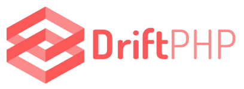

# DriftPHP Skeleton

Proyecto para aprender sobre [DriftPHP], un framework para desarrollar aplicaciones
web de una forma muy diferente.

Si no sabes cómo empezar, quizá te parezca bien comenzar por mi [documentación
interna]

## README original

Del repositorio oficial [driftphp/skeleton]:

Welcome to the skeleton of DriftPHP. In this small repository you will find an
extraordinary way of starting using DriftPHP and ReactPHP in your projects. Just
install it, load dependencies, and you will be ready to start building fast and
insane applications on top of Symfony and ReactPHP components.

  

Some first steps for you!

- [Go to DOCS](https://driftphp.io)
- [Try a demo](https://github.com/driftphp/demo)

you can check out packages as well.

- [Redis adapter](https://github.com/driftphp/redis-bundle)
- [Mysql adapter](https://github.com/driftphp/mysql-bundle)
- [Twig adapter](https://github.com/driftphp/twig-bundle)

[DriftPHP]: https://driftphp.io
[driftphp/skeleton]: https://github.com/driftphp/skeleton
[documentación interna]: docs/index.md
